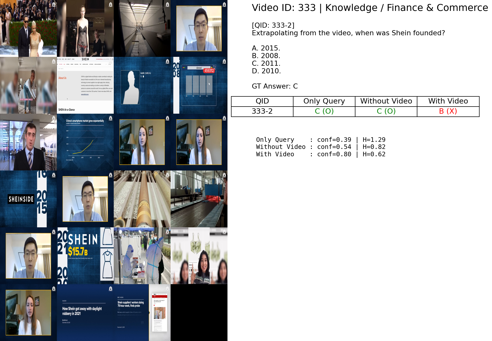
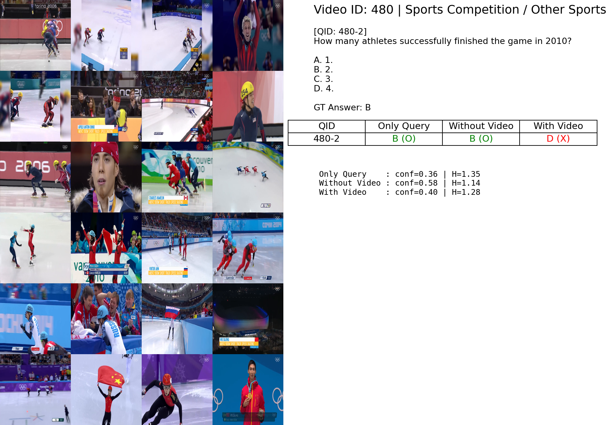

# Long Video Understanding Analysis based on MLLM

본 저장소는 (1차년도) 한국연구재단 우수신진연구과제 / OTT 사용자 분석을 위한 데이터 결합 및 증식 기술의
**「사용자 맞춤형 콘텐츠 미리보기 및 요약 자동 생성 연구를 위한 대형모델 활용 기술 개발」**  
의 일환으로 수행된 연구 결과를 정리한 것이다.

본 연구의 목적은 **장기간(Long Video) 영상 이해를 위한 대형 멀티모달 모델의 성능 특성**을 분석하고,  
시각적 정보가 장기간 영상 이해 정확도 및 예측 불확실성(Entropy)에 미치는 영향을 이해하는 데 있다.

---

## Overview

- **Baseline Method**
  - Video-RAG: Visually-aligned Retrieval-Augmented Long Video Comprehension
- **Dataset**
  - Video-MME (비디오의 길이에 따라 Short / Medium / Long으로 구분)
- **Logit 수**: 16, 20, 24, 28, 32  
  - logit *N*은 하나의 비디오에서 *N개의 프레임을 추출하여 모델 입력으로 활용*함을 의미함
- **Metrics**
  - Accuracy
  - Entropy (예측 분포의 불확실성)

본 저장소는 **모델 개발 또는 재배포 목적이 아닌**,  
LLaVA-NeXT 기반 장시간 영상 이해 성능 분석을 위한 **실험·분석 코드 및 결과 정리**를 목표로 한다.

---

## Results

### Short Videos

| Logit | Accuracy | Entropy |
|------:|---------:|--------:|
| 16 | 0.73465 | 0.55269 |
| 20 | 0.74561 | 0.52973 |
| 24 | 0.74567 | 0.51824 |
| 28 | 0.73904 | 0.51994 |
| 32 | **0.75658** | **0.51074** |
| **Average** | **0.74431** | **0.52628** |


### Medium Videos

| Logit | Accuracy | Entropy |
|------:|---------:|--------:|
| 16 | 0.61111 | 0.70880 |
| 20 | 0.60516 | 0.70985 |
| 24 | **0.63294** | 0.70393 |
| 28 | 0.60714 | 0.70422 |
| 32 | 0.62500 | **0.68986** |
| **Average** | **0.61627** | **0.70533** |

### Long Videos

| Logit | Accuracy | Entropy |
|------:|---------:|--------:|
| 16 | 0.57436 | 0.72397 |
| 20 | 0.56923 | 0.71767 |
| 24 | 0.57179 | 0.74109 |
| 28 | **0.58974** | 0.73106 |
| 32 | 0.57949 | 0.72978 |
| **Average** | **0.57692** | **0.72871** |

### 이미지가 노이즈로 작용하는 정성적 결과

<p align="center">
  
  
</p>

---

## Key Findings

- 프레임 수(logit)가 증가한다고 해서 **항상 성능이 향상되지는 않음**
- Medium / Long 비디오 구간에서는  
  특정 프레임 수(예: 24, 28)에서 최적 성능이 관찰됨
- 과도한 프레임 입력은
  - 정보 중복
  - 노이즈 증가
  - 모델 추론 부담
  으로 인해 성능 저하로 이어질 수 있음
- Entropy 분석 결과 또한 프레임 수 증가가
  **항상 예측 불확실성 감소로 이어지지 않음**을 확인함

이는 **장시간 영상 이해를 위한 프레임 선택 및 요약 전략의 중요성**을 시사한다.

---

## Upstream Projects

본 연구는 아래 오픈소스 프로젝트 및 연구 결과를 기반으로 진행되었습니다.

- **LLaVA-NeXT**
  - GitHub: https://github.com/LLaVA-VL/LLaVA-NeXT
  - Blog: https://llava-vl.github.io/blog/
- **Video-RAG**
  - Paper: https://arxiv.org/abs/2411.13093

---

## Citation

본 저장소는 아래의 연구에 도움을 받았습니다.

```bibtex
@misc{luo2024videoragvisuallyalignedretrievalaugmentedlong,
      title={Video-RAG: Visually-aligned Retrieval-Augmented Long Video Comprehension}, 
      author={Yongdong Luo and Xiawu Zheng and Xiao Yang and Guilin Li and Haojia Lin and Jinfa Huang and Jiayi Ji and Fei Chao and Jiebo Luo and Rongrong Ji},
      year={2024},
      eprint={2411.13093},
      archivePrefix={arXiv},
      primaryClass={cs.CV},
      url={https://arxiv.org/abs/2411.13093}, 
}
@article{li2024llava,
  title={LLaVA-NeXT-Interleave: Tackling Multi-image, Video, and 3D in Large Multimodal Models},
  author={Li, Feng and Zhang, Renrui and Zhang, Hao and Zhang, Yuanhan and Li, Bo and Li, Wei and Ma, Zejun and Li, Chunyuan},
  journal={arXiv preprint arXiv:2407.07895},
  year={2024}
}

@misc{li2024llavanext-ablations,
	title={LLaVA-NeXT: What Else Influences Visual Instruction Tuning Beyond Data?},
	url={https://llava-vl.github.io/blog/2024-05-25-llava-next-ablations/},
	author={Li, Bo and Zhang, Hao and Zhang, Kaichen and Guo, Dong and Zhang, Yuanhan and Zhang, Renrui and Li, Feng and Liu, Ziwei and Li, Chunyuan},
	month={May},
	year={2024}
}

@misc{li2024llavanext-strong,
    title={LLaVA-NeXT: Stronger LLMs Supercharge Multimodal Capabilities in the Wild},
    url={https://llava-vl.github.io/blog/2024-05-10-llava-next-stronger-llms/},
    author={Li, Bo and Zhang, Kaichen and Zhang, Hao and Guo, Dong and Zhang, Renrui and Li, Feng and Zhang, Yuanhan and Liu, Ziwei and Li, Chunyuan},
    month={May},
    year={2024}
}

@misc{zhang2024llavanext-video,
  title={LLaVA-NeXT: A Strong Zero-shot Video Understanding Model},
  url={https://llava-vl.github.io/blog/2024-04-30-llava-next-video/},
  author={Zhang, Yuanhan and Li, Bo and Liu, haotian and Lee, Yong jae and Gui, Liangke and Fu, Di and Feng, Jiashi and Liu, Ziwei and Li, Chunyuan},
  month={April},
  year={2024}
}

@misc{liu2024llavanext,
    title={LLaVA-NeXT: Improved reasoning, OCR, and world knowledge},
    url={https://llava-vl.github.io/blog/2024-01-30-llava-next/},
    author={Liu, Haotian and Li, Chunyuan and Li, Yuheng and Li, Bo and Zhang, Yuanhan and Shen, Sheng and Lee, Yong Jae},
    month={January},
    year={2024}
}

@misc{liu2023improvedllava,
      title={Improved Baselines with Visual Instruction Tuning}, 
      author={Liu, Haotian and Li, Chunyuan and Li, Yuheng and Lee, Yong Jae},
      publisher={arXiv:2310.03744},
      year={2023},
}

@misc{liu2023llava,
      title={Visual Instruction Tuning}, 
      author={Liu, Haotian and Li, Chunyuan and Wu, Qingyang and Lee, Yong Jae},
      publisher={NeurIPS},
      year={2023},
}
